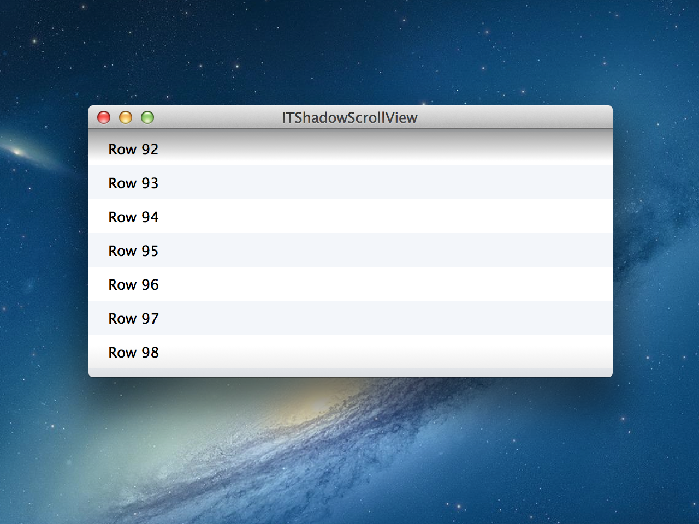

ITShadowScrollView
==================

A simple subclass of `NSScrollView` that draws a shadow if appropriate.

Usage
-----

### Copy files

Copy the following files:

* `ITShadowScrollView.h`
* `ITShadowScrollView.m`
* `ITSidebarView.h`
* `ITSidebarView.m`

Make sure to copy them to the project, and to add them to the target.

### Use in a project

The usage of `ITShadowScrollView` is ridiculously easy.
Simply set the custom class of the `NSScrollView` you want to use to `ITShadowScrollView`.

You can customise the behaviour of the shadow with the following properties.
Note that these properties are a part of `ITShadowView`, so you need to access them through the `shadowView` property in the `ITShadowScrollView` class.

    /**
     * @property shadowHeight - The height of the shadow
     */
    @property (nonatomic) float shadowHeight;
    
    /**
     * @property fadeMargin - Stands for the amount of scrolling you have to do until the opacity of the shadow is 100%
     */
    @property (nonatomic) float fadeMargin;
    
    /**
     * @property shadowOpacity - The full opacity of the shadow
     */
    @property (nonatomic) float shadowOpacity;
    
    /**
     * @property topMargin - The current top margin of the document view
     */
    @property (nonatomic) float topMargin;
    
    /**
     * @property bottomMargin - The current bottom margin of the document view
     */
    @property (nonatomic) float bottomMargin;

    
### License

    DO WHAT THE FUCK YOU WANT TO PUBLIC LICENSE 
    Version 2, December 2004 
    
    Copyright (C) 2013 Ilija Tovilo <support@ilijatovilo.ch> 
    
    Everyone is permitted to copy and distribute verbatim or modified 
    copies of this license document, and changing it is allowed as long 
    as the name is changed. 
    
    DO WHAT THE FUCK YOU WANT TO PUBLIC LICENSE 
    TERMS AND CONDITIONS FOR COPYING, DISTRIBUTION AND MODIFICATION 

    0. You just DO WHAT THE FUCK YOU WANT TO.

### Help

If you have any questions, feel free to let me know at support@ilijatovilo.ch
